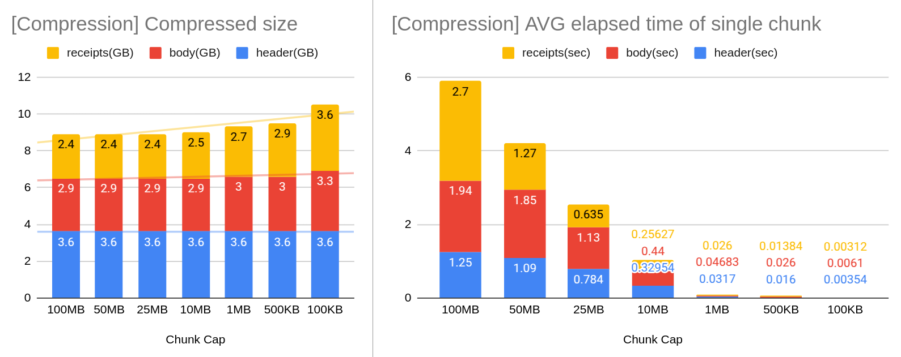
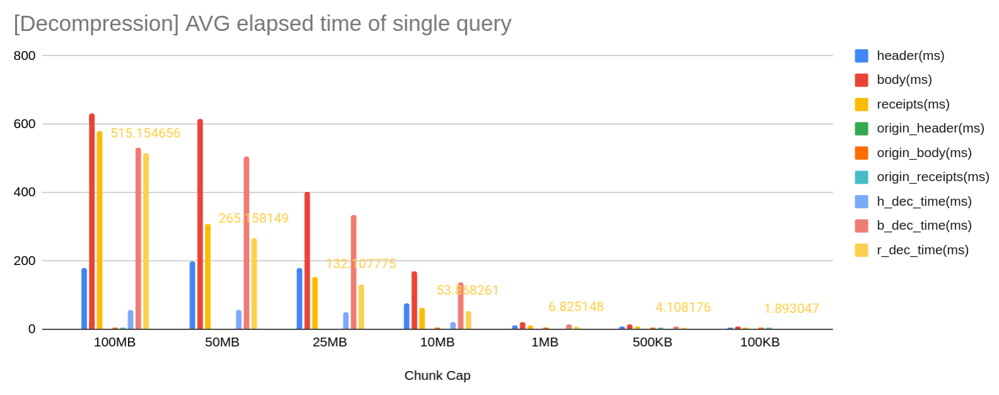

## Abstract
Compress the block header, body, and receipts data in its persistent form to reduce disk usage.
With an efficient data structure, historic data remains accessible with minimal query overhead from the lossless-compressed database.

## Motivation
Kaia has been focusing on optimizing the state trie storage through [state migration and live pruning](https://docs.kaia.io/learn/storage/state-pruning/).
While these optimizations dealt with the most significant part of the database, there is still potential to further reduce the other parts of the database.
This KIP reduces the storage footprint of the following three data types:
- Header: RLP-encoded block header. Most header fields are repeated across headers.
- Body: RLP-encoded transaction bodies in a block. Transaction calldatas tend to contain many zero bytes and the contents are often similar between different transactions.
- Receipts: RLP-encoded transaction receipts in a block. Receipt event logs tend to contain many zero bytes and the contents are often similar between different transactions.

The three data types are generated every time a new block is inserted.
They consume a substantial amount of storage. As of 2024-12-02, In the migrated mainnet chaindata, the header, body, and receipts account for 10.4%, 28.1%, and 40.9% of the total size, respectively, which together occupy 79.4% of the node's disk space.
This illustrates that the state trie is no longer a dominant data in the full-node with pruned states.
This KIP proposes to compress the three data types to reduce the total disk size, thereby making the node operation more efficient and affordable.

### Compression
A node periodically compresses storage in a background thread and removes the original data once it is confirmed safe to do so.
Data is compressed in units called "chunks".
An optimal chunk size should balance a high compression rate with minimal decompression overhead.
Determining the ideal chunk capacity remains an open problem. However, our experiments suggest that a 1MB chunk size offers a favorable trade-off.

Currently, the chunk size is fixed at 1MB and cannot be configurable.

### Decompression
Decompression is required when a node receives a query (header, body, or receipts).
The node first searches for the corresponding data in the original database.
If the data is not found, it locates the decompressed chunk and performs the decompression. The decompressed chunk is cached for later use.

### Retention
Retention follows the same semantics as LivePruning, preserving the latest n blocks to prevent them from being compressed.

### Evaluation
We evaluated compression module on mainnet([chaindata of 12/02/2024](https://packages.kaia.io/mainnet/chaindata/)).
| Item    | Header | Body | Receipts |
| ------- | ------- | ------- | ------- |
| Origin size | 410G | 1100G | 1600G |
| Compressed size | 261G (40.24%) | 267G (75.73%) | 179G (88.81%) |

Compression had been completed wihtin 3 days.

### Ecosystem changes
No changes are required to the existing API usage and SDK.

## Implementation
https://github.com/kaiachain/kaia/pull/155

## Copyright
Copyright and related rights waived via [CC0](https://creativecommons.org/publicdomain/zero/1.0/).
